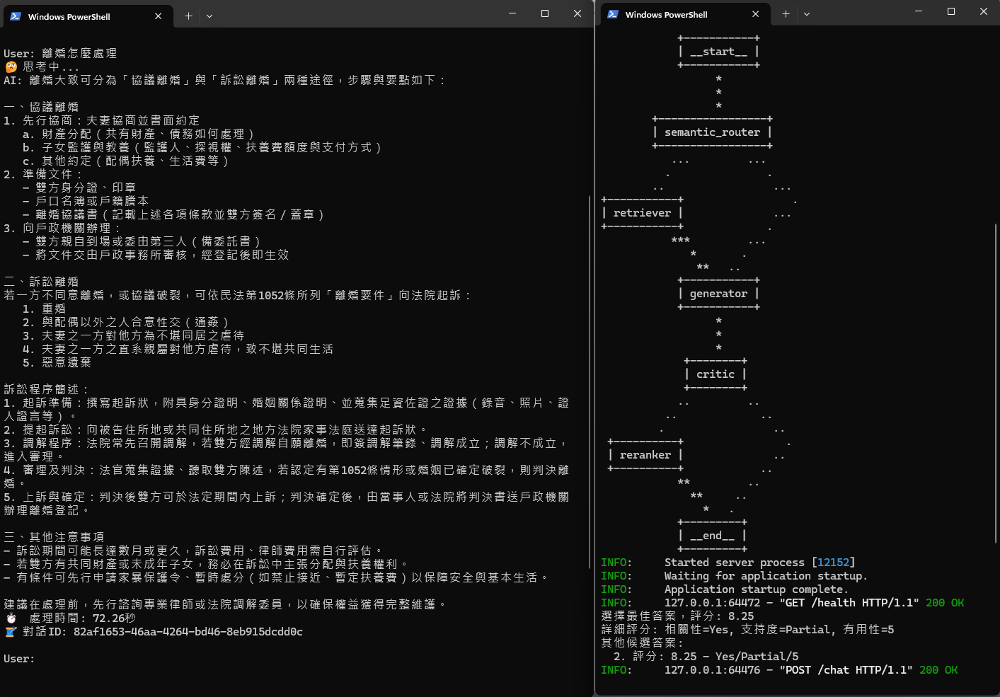

# 法律諮詢聊天機器人

一個基於 LangGraph 和 FastAPI 的智能法律諮詢系統，提供專業的法律問題解答和諮詢服務。

## 📋 目錄

- [功能特色](#功能特色)
- [Chatbot運作流程](#Chatbot運作流程)
- [專案結構](#專案結構)
- [核心組件](#核心組件)
- [快速開始](#快速開始)
- [使用範例](#使用範例)


<a id="功能特色"></a>
## 🚀 功能特色

### 核心功能
- **語義路由**: 自動判斷是否需要檢索法律文檔
- **多個法律領域**: 涵蓋刑法、婚姻法、債務法等主要法律領域
- **法律文檔檢索**: 基於向量資料庫的語義搜尋
- **答案生成**: 使用 LLM 生成專業法律建議
- **答案品質評估**: 多維度評估答案的相關性、支持度和有用性
- **綜合評分排序**: 基於綜合評分選擇最佳答案

### 技術特色
- **模組化設計**: 基於 LangGraph 的節點化架構
- **RESTful API**: 完整的 FastAPI Web 服務

### Chatbot 示範

以下是法律諮詢聊天機器人的實際使用示範：




<a id="Chatbot運作流程"></a>
## 🏗️ Chatbot運作流程


### 工作流程

1. **語義路由** (`semantic_router`): 判斷問題是否需要檢索法律文檔
2. **法律文檔檢索** (`retriever`): 從向量資料庫中檢索相關法律條文
3. **答案生成** (`generator`): 基於問題和文檔生成法律建議
4. **答案品質評估** (`critic`): 評估答案的相關性、支持度和有用性
5. **綜合評分排序** (`reranker`): 基於多維度評分選擇最佳答案


<a id="專案結構"></a>
## 📁 專案結構

```
ChatBot/
├── legal_consult_agent/          # 核心代理模組
│   ├── __init__.py
│   ├── agent.py                  # LangGraph 工作流程定義
│   ├── nodes/                    # 工作流程節點
│   │   ├── semantic_router.py    # 語義路由
│   │   ├── retriever.py          # 法律文檔檢索
│   │   ├── generator.py          # 答案生成
│   │   ├── critic.py             # 答案品質評估
│   │   └── reranker.py           # 綜合評分排序
│   └── utils/                    # 工具模組
│       ├── state.py              # 工作狀態定義
│       ├── models.py             # LLM 模型配置
│       ├── embeddings.py         # 嵌入模型配置
│       ├── tools.py              # 向量資料庫工具
│       └── data_loader.py        # 資料載入器
├── vectorDB/                     # 向量資料庫
│   ├── data/                     # 法律文檔資料
│   │   ├── criminal.json         # 刑法資料
│   │   ├── marriage.json         # 婚姻法條資料
│   │   └── money_debt.json       # 金錢債務法條資料
│   └── chroma.sqlite3           # ChromaDB 資料庫
├── start_server.py              # FastAPI 服務器
├── test_client.py               # 測試客戶端
├── load_data.py                 # 資料載入腳本
├── pyproject.toml               # 專案配置
└── README.md                    # 專案文檔
```

<a id="核心組件"></a>
## 🔧 核心組件

### 1. 語義路由 (Semantic Router)
- **功能**: 自動判斷用戶問題是否需要檢索法律文檔
- **輸入**: 用戶問題和對話歷史
- **輸出**: 路由決策 (Yes/No)

### 2. 法律文檔檢索 (Retriever)
- **功能**: 從向量資料庫檢索相關法律條文
- **支援領域**: 刑法、婚姻法、債務法
- **檢索方式**: 語義相似度搜尋
- **可擴展**: 依照領域將法律文檔分門別類，新領域資料可以新增向量資料庫對應之 Collection
- **可抽換**: 可選用其他商業嵌入模型、或開源嵌入模型

### 3. 答案生成 (Generator)
- **功能**: 基於問題和文檔生成法律建議
- **模型**: OpenAI GPT-4
- **輸出**: 結構化的法律建議
- **可抽換**: 可選用其他商業模型、或開源模型

### 4. 答案品質評估 (Critic)
- **評估維度**:
  - **相關性** (IsRelevant): 答案是否與問題相關
  - **支持度** (IsSupport): 答案是否能被文檔支持、支持程度
  - **有用性** (IsUseful): 答案是否對用戶有幫助、幫助程度

### 5. 重新排序 (Reranker)
- **功能**: 基於多維度評分選擇最佳答案
- **評分算法**: 加權綜合評分
- **排序策略**: 降序排列，選擇最高分答案
- **可調整**: 加權機制可以自行設定權重


<a id="快速開始"></a>
## 🚀 快速開始

### 環境要求

- Python 3.12+
- OpenAI API Key
- uv 包管理工具

### 安裝步驟

1. **Clone 專案**
```bash
git clone https://github.com/zrkluke/Chatbot.git
cd ChatBot
```

2. **建置環境**

**安裝 UV 套件管理器**

**macOS / Linux:**
```bash
curl -LsSf https://astral.sh/uv/install.sh | sh
```

**Windows:**
```powershell
powershell -ExecutionPolicy ByPass -c "irm https://astral.sh/uv/install.ps1 | iex"
```

**安裝依賴套件:**
```bash
uv sync
```

3. **設定環境變數**
```bash
# 建立 .env 文件
OPENAI_API_KEY="your_api_key_here"
OPENAI_MODEL="your_model"
OPENAI_REASONING_MODEL="your_reasoning_model"
OPENAI_EMBEDDING_MODEL="your_embedding_model"
```

4. **載入法律資料**
```bash
uv run load_data.py
```

5. **啟動服務器**
```bash
uv run start_server.py
```

6. **測試客戶端**
```bash
# 互動式聊天
uv run test_client.py
```


<a id="使用範例"></a>
## 💡 使用範例

### 命令列使用

```bash
# 啟動服務器
uv run start_server.py
```

```bash
# 互動式聊天
uv run test_client.py
```


### 自定義評分算法

```python
# 在 nodes/reranker.py 中修改評分權重
def calculate_score(is_relevant, is_support, is_useful, weights=None):
    if weights is None:
        weights = {
            "relevant": 0.4,  # 相關性權重
            "support": 0.35,  # 支持度權重
            "useful": 0.25    # 有用性權重
        }
    # 自定義評分邏輯
```

---

**注意**: 本系統僅供學習和研究使用，不構成正式的法律建議。在實際法律問題中，請諮詢專業律師。
